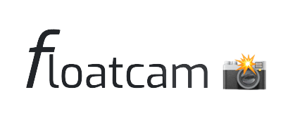

Floatcam is a simple, lightweight, and easy to use camera app that you can use alongside any screen recorder. It floats on top of other apps, so you can easily record your screen and your face at the same time. 

It is perfect for recording tutorials, gameplay, or anything else you want to share with the world. You can easily move it around while recording as opposed to doing it in post-production.

## Features

Floatcam features a wide range of settings for 

- Customizing the shape of the floating window
- Changing the size of the floating window
- Adding a filter to the camera preview
- Adding a border to the window 

Floatcam is free and open source software. You can find the source code on [GitHub]

There are too many screen recorders out there so Floatcam doesn't come with one. Instead, you can use any screen recorder you want. I recommend [AZ Screen Recorder] or [DU Recorder].

## Why Floatcam?

There are a lot of screen recorders out there but most of them don't have a built-in camera. Others do but it's either not floating, they can't be moved around, or not customizable. Some even requires payment for such a simple feature. 

### A brief history of Floatcam

I remember using the default screen recorder on Mac (QuickTime). On Quicktime, you can easily record your screen and your face at the same time but the challenge with recording your face is that your camera preview is forever forced to sit in a rectangular box with a fixed minimum size. You also can't change the shape of the window, or add filters or do crazy things like effects. Loom, a popular screen recorder let's you do some of these things but it's not free. With so many screen recorders out there, I thought it would be nice to have a simple camera app that you can use alongside any screen recorder.

I hope you enjoy using Floatcam as much as I enjoyed making it. If you have any questions, suggestions, or feedback, feel free to reach out to me on [Twitter] or [Telegram].

## Roadmap

I have thought about some cool features that I would like to add to Floatcam like screen annotation, a simple whiteboard, area protection and more. 

While all of these features are cool, it's not the reason why I made Floatcam. I will add those features when I have the time, also feel free to contribute to the project if you want to add any of these features.

## Contributing

If you want to contribute to Floatcam, you can do so by: 

- Reporting bugs
- Fixing bugs
- Suggesting and adding new features

## Download

Floatcam is available on macOS, Windows and Linux. You can download it from the [releases] page.

## License

## Support

If you like Floatcam, you can support me by buying me a coffee.
